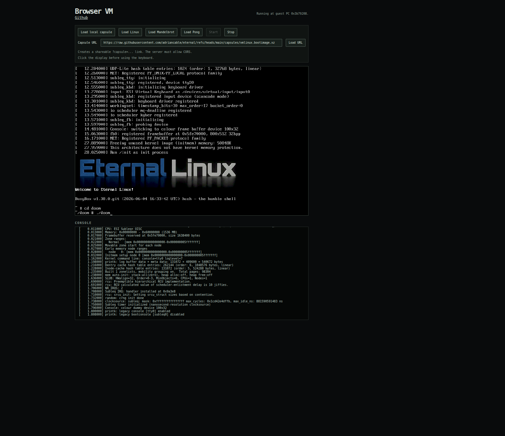
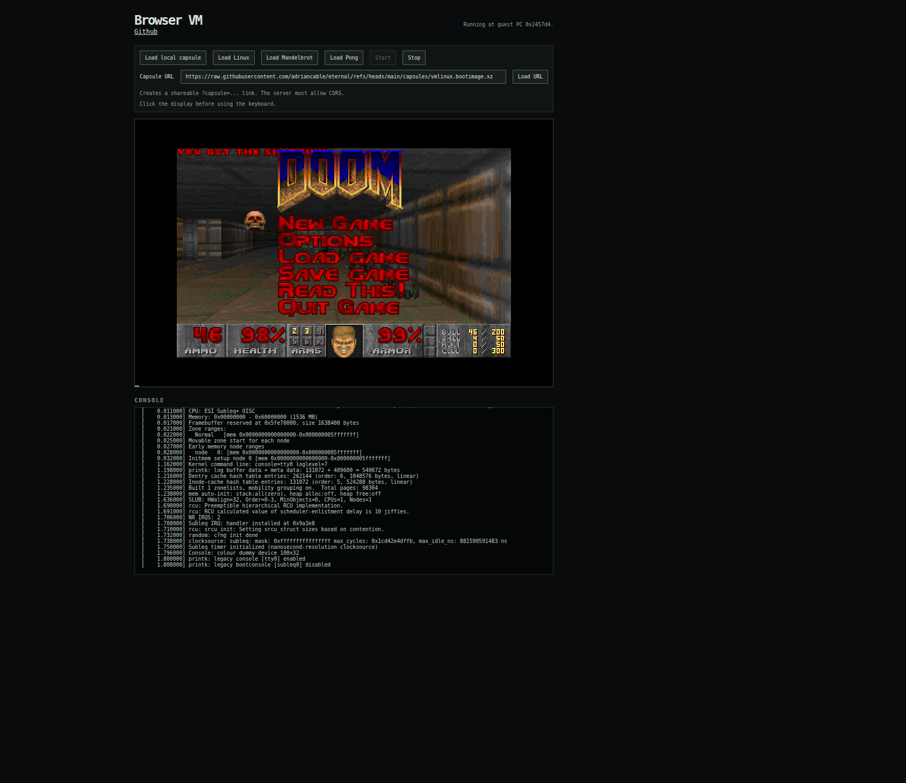

# Eternal Browser VM

This repository contains a browser port of the
[Eternal Software Initiative (ESI)](https://www.eternal-software.org) virtual machine.

It runs capsules produced by the main project and allows loading compressed capsules by URL.

The project includes:

- a port of the ESI C VM (`vm_asm.c`), which is compiled to WebAssembly with Clang.
- a Web Worker (`worker.js`), which renders the framebuffer through `OffscreenCanvas`, and sends console output to the page
- `main.js`, which
  - loads the worker and VM
  - loads and decompresses "capsules"
  - listens for Keyboard events, maps them and sends them to the VM
  - renders the canvas and console
- a baic HTML page to host the whole thing


## [➡️  Open the VM in your browser ⬅️](https://vm.dave.engineer/)

## Background information

The [main Eternal repository](https://github.com/adriancable/eternal)
contains the ESI architecture specification, LLVM toolchain, Linux port,
runtimes, reference VM, and tools for building self-contained software
capsules.

This browser port does not include the toolchain or capsule build system.

Useful main-project links:

- [Project overview and build instructions](https://github.com/adriancable/eternal#readme)
- [ESI machine architecture reference](https://github.com/adriancable/eternal/blob/main/docs/machine_architecture.md)
- [Reference VM](https://github.com/adriancable/eternal/blob/main/vm/vm.c)

## Screenshots

| Linux | Doom |
| --- | --- |
|  |  |

## How does it work?

```c
mem[(uint32_t)b] -= mem[(uint32_t)a];
if (mem[(uint32_t)b] <= 0) {
    pc = (uint32_t)c;
}
```

## Build requirements

- Clang and wasm-ld with the `wasm32` target
- Python 3 or another static HTTP server
- A browser with WebAssembly and `OffscreenCanvas`
- Enough memory for the fixed 1.5 GiB guest address space

On Debian or Ubuntu, install the build and server dependencies with:

```sh
sudo apt update
sudo apt install clang lld-18 make python3
```

Install Node.js as well to run the tests:

```sh
sudo apt install nodejs
```

## Build and Run

```sh
make
make serve
```

Open `http://localhost:8000`, load one of the linked Linux, Mandelbrot, or Pong
capsules, enter a capsule URL, or select a local `.bootimage` or `.bootimage.xz`,
and press Start. Remote servers must permit cross-origin browser requests.

Loading a remote capsule updates the address bar with a shareable
`?capsule=<URL>` link; opening that link loads and starts the capsule. Click the
framebuffer before using the keyboard.

Capsules can be built or downloaded from
the [main Eternal repository](https://github.com/adriancable/eternal).

Run the small interpreter smoke test with:

```sh
make test
```

To run the XZ/Linux integration test, clone the main project alongside this
repository and run:

```sh
make test-xz
```

Use `make test-xz CAPSULE=/path/to/capsule.bootimage.xz` if the capsule is
elsewhere.

XZ capsules are decompressed in the browser using the vendored
[`xz-decompress`](https://github.com/httptoolkit/xz-decompress) WebAssembly
decoder.

## Design Notes

- The interpreter runs bounded batches so the worker can process keyboard and
  control messages between batches.
- Guest timer interrupts remain instruction-count based, matching `vm/vm.c`.
- The full guest address space is allocated eagerly for the simplest and
  fastest desktop implementation.
- XZ decompression streams through the decoder, then collects the decompressed
  capsule into an `ArrayBuffer` before transferring it to the VM worker.
- ESI `0xRRGGBB` framebuffer words are converted to Canvas RGBA pixels in the
  worker.
- Browser keyboard `code` values are translated to SDL-compatible scancodes in
  `main.js`. The current table covers letters, digits, arrows, and common
  control keys.

Mobile and memory-constrained browser support will require replacing the
contiguous guest array with sparse or paged memory.

## License

This project is available under the [MIT License](LICENSE). The vendored XZ
decoder contains components under their own permissive licenses; see
[`vendor/README.md`](vendor/README.md) and the license header in the vendored
bundle.
